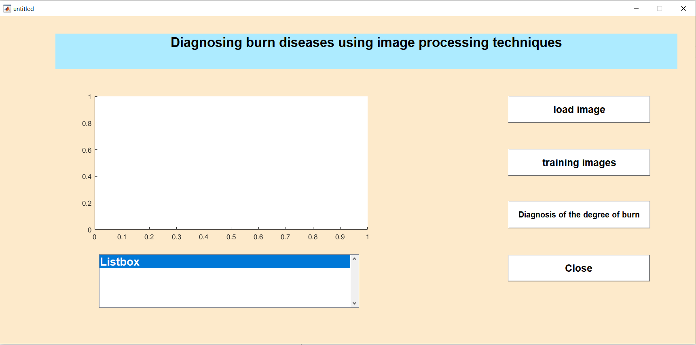
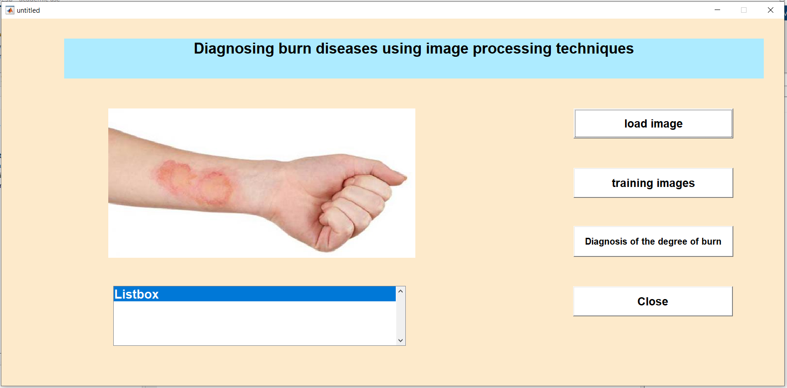
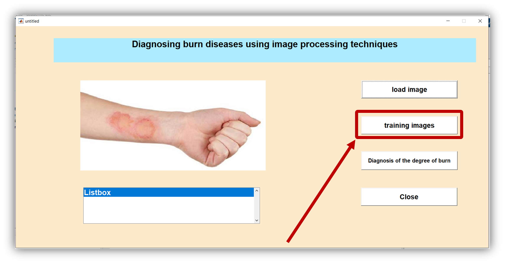
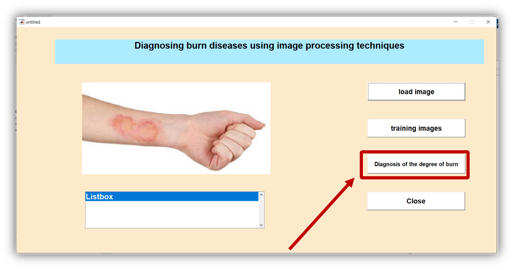
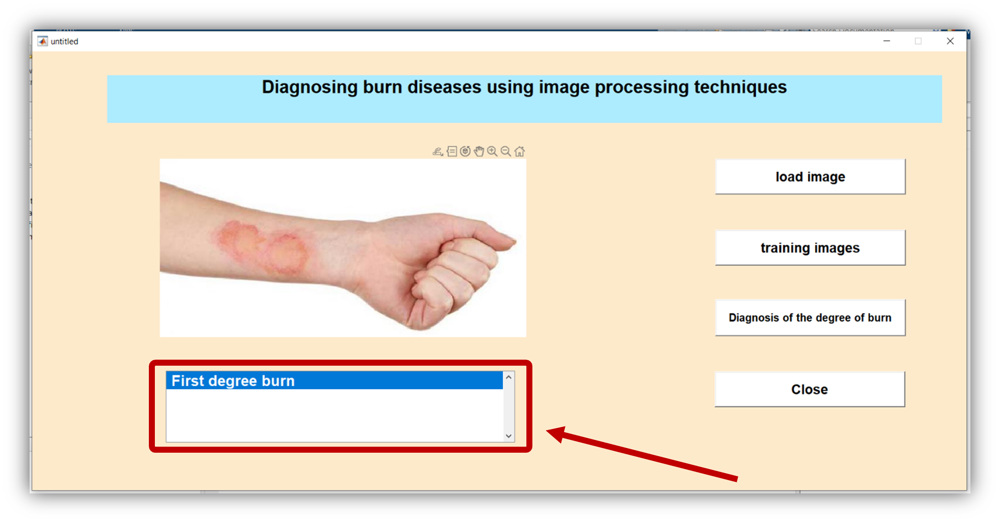
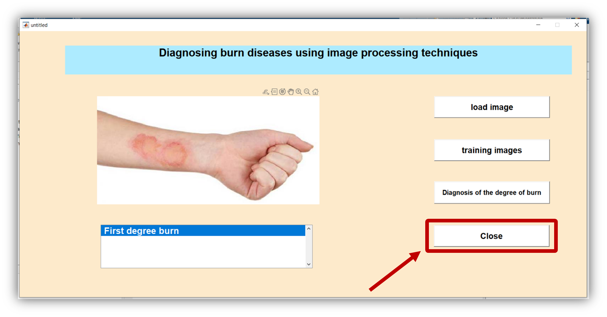

# Diagnosing burn cases through image processing in MATLAB

## Description

We have developed an automated diagnosis system using MATLAB that can determine the degree of a burn through image classification. The system uses medical images of burns and classifies them using advanced algorithms to extract features that help doctors classify the burn severity and decide on the optimal treatment. The project aims to assist doctors in accurately and quickly determining burn degrees by analyzing images with Discrete Wavelet Transform (DWT) techniques and energy calculation.

## User Interface



## Contents

- [Description](#Description)
- [Features](#Features)
- [How to use](#How-to-use)
- [Files and Structure](#Files-and-Structure)
- [Requirements](#Requirements)
- [Install](#Install)
- [Contributions](#Contributions)
- [Communication](#Communication)

## Features

- Image analysis using DWT
- Diagnosing the degree of burns (first, second, third degree)
- Simple and easy to use user interface
- High accuracy in classifying burn degrees
- Ability to handle a large database of images
- The possibility of training the system on new images to improve performance

## How-to-use

1. Click the “Load Image” button to load the burn image.
   

2. Click the “training images” button to analyze the images in the database and wait a few seconds.
   

3. Click the “Diagnosis of the degree of burn” button to see the burn score of the uploaded image.
   

4. The burn degree result will appear in the listbox.
   

5. Press the “close” button to exit the program.
   

## Files-and-Structure

```
.
├── database/                     # A folder containing database images
├── save/                         # Folder to save the results
├── plant.mat                     # File containing features extracted from database images
├── untitled.m                    # The main file to run the project
├── untitled.fig                  # Home User Interface File
├── untitled.asv                  # Automatic backup file that MATLAB creates to save a backup copy of working files
├── Graduation project booklet    # The book on the project
└── README.md                     # Project documentation file
```

## Requirements

- MATLAB
- Matlab's following libraries :
  - Wavelet Toolbox

## Install

1. Reproduce the warehouse :

   ```sh
   git clone https://github.com/mahmoudmustafa11/Graduation-Project-
   ```

2. Open Matlab and go to the cloned folder.
3. Run the main file `untitled.m`.

## Contributions

All contributions are welcome! You can open a problem if you find an error or you have a suggestion, or you can send a Pull Request to contribute to the project improvement

## Communication

If you have any questions or inquiries, you can contact us me via : [melshahat799@gmail.com](mailto:melshahat799@gmail.com)
